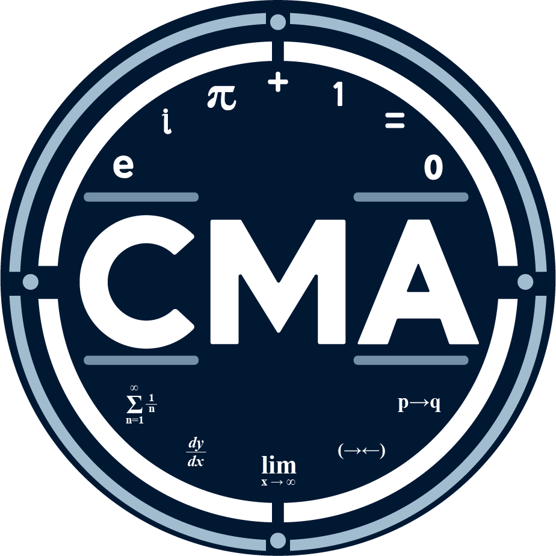

# CMA wiki

## Tabla de contenidos

1. [Introducción](#introduction)
2. [Estructura del club](#club-structure)
3. [Talleres teóricos](#workshops)
4. [Plan de estudios](#curriculum)
5. [Concursos](#contests)
6. [Recursos](#resources)
7. [Office Hours](#7-office-hours)
8. [Q&A Channel](#q-and-a)

## 1. Introducción

### Misión

Construir una espacio dentro de la comunidad universitaria donde los estudiantes apasionados por las matemáticas puedan desarrollar sus habilidades mediante la asesoría de expertos, la colaboración, la sana competencia y la auto-superación.

### Visión

Representar a UTEC en competiciones de matemática a nivel nacional e internacional, con resultados gradualmente mejores cada año.

### Valores

- Amor al conocimiento
- Auto-superación
- Perseverancia
- Espíritu colaborativo
- Diversidad de pensamiento e ideas

## 2. Estructura del club

Los miembros del club están divididos en dos divisiones: senior y junior.

### Junior

- Acceso a todo el material.
- Acceso a talleres teóricos a cargo de estudiantes [senior](#senior) para cubrir el [temario de la división junior](#junior-division).
- Acceso a los canales de comunicación del club y las [_office hours_](#office-hours).
- Material adicional de preparación para los [concursos organizados](#contests).

### Senior

- Todo lo disponible para la división Junior.
- Acceso a talleres teóricos a cargo de los dos [asesores](#advisers).
- Acceso a talleres a carag de profesores invitados.
- Eligibilidad para competir en olimpiadas.
  - Olimpiada Iberoamericana de Matemáticas.

### Asesores

- Jorge Tipe
  - Profesor del departamento de CS.
- Ángel Napa
  - Profesor del departamento de CS.

## 3. Talleres teóricos

_Disclaimer:_ el 2024-1 está orientado a la cobertura del [temario de la división junior](#junior-division) para todos los miembros por igual para, idealmente, comenzar todos los miembros con el [temario de la división senior](#senior-division) desde el 2024-2. Asimismo, el temario _senior_ todavía se encuentra en elaboración, con la orientación de los asesores del club.

- Taller de Introducción a las Matemáticas Discretas

  - Jueves 16 - 18 h
  - Encargado: Eduardo Aragón

- Taller de Introducción al Cálculo y Análisis
  - Sábado 12 - 14 h
  - Encargado: Benjamín Soto

## 4. Plan de estudios

### Junior Division:
Para el detalle de los subtemas para cada uno de los tópicos, referirse a este [documento](https://github.com/mukanjy0/cma-wiki/blob/7f6938c5b2c7a3cb1dff3a0de9f10cf61168eca7/curriculum/junior-division.pdf). A continuación se detallan los principales tópicos:

- Introducción al Cálculo y Análisis

  - Trigonometría
  - Cónicas
  - Funciones de variable real
  - Sucesiones
  - Series
  - Polinomios
  - Límites
  - Derivadas
  - Integrales

- Introducción a las Matemáticas Discretas

  - Métodos demostrativos
  - Combinatoria
  - Teoría de Números

### Senior Division:

- Cálculo y Análisis (_en desarrollo_)

- Matemáticas Discretas (_en desarrollo_)

- Álgebra Lineal (_en desarrollo_)

## 5. Concursos

Este ciclo, CMA organizará dos concursos abiertos a toda la comunidad UTEC:

- Concurso de Matemáticas Discretas.
- Concurso de Cálculo.

Próximamente tendremos más información para compartir.

## 6. Recursos

### Junior

- [Google Drive](https://drive.google.com/drive/folders/1huYvlk5imYaKXg1aN4rLjpMKNCOsfNXv?usp=drive_link)
- [Classroom - Introducción al Cálculo y Análisis](https://classroom.google.com/c/NjcyODM3MzU3ODM0?cjc=mweflao)
- [Classroom - Introducción a Matemáticas Discretas](https://classroom.google.com/c/NjcyODc1MzY3ODU1?cjc=asytjyy)

## 7. Office Hours

Virtualmente en el servidor Discord, en el canal de voz del mismo nombre. Podrán ingresar para plantear dudas o consultas sobre cualquier tema visto hasta la fecha, aunque preferiblemente sobre los temas vistos previamente en la semana.

- Domingo 13 - 21 h.

## 8. Q&A Channel

Por el momento pueden escribir sus dudas por el canal de texto **general** en el servidor de Discord, pero se tiene planeado crear un canal con preguntas frecuentes y sus respuestas.
